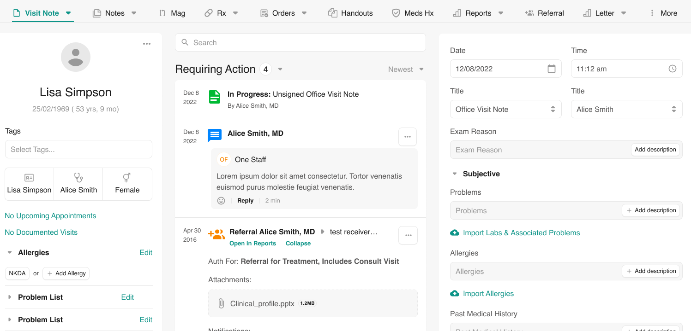

<h1 align="center">Patient Medical Portal (PMP)</h1>

A free and open-source healthcare webapp built on top of Medplum SDK

### Features
- Patient registration and authentication
- Health records
  - Lab results
  - Medications
  - Vaccines
  - Vitals
- Patient-provider messaging
- Care plans
- Patient scheduling
- All data represented in [FHIR](https://hl7.org/FHIR/)
